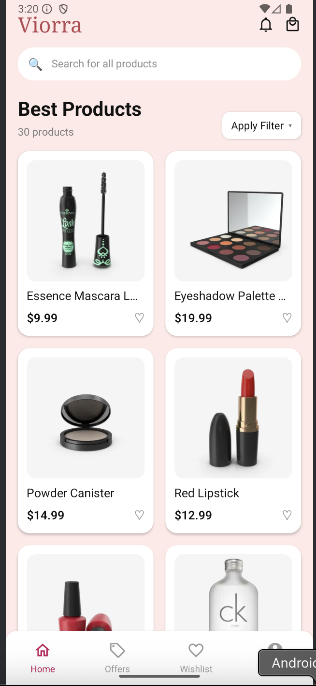

# GlowCart — React Native App

A React Native 0.81 app styled to a Figma design. It includes Onboarding, Login, Register, Home (catalog + search), Product Detail, and Profile screens. Icons are from `react-native-vector-icons`.

## Setup instructions

Prerequisites

- Node.js 18+
- Java 17 (for Android)
- Android Studio with SDK 36 and a device/emulator
- Optional: Xcode 15+ for iOS

Clone and install

```bash
git clone https://github.com/rahul-adepu/GlowCart.git
cd GlowCart
npm install
```

Run on Android

```bash

npx react-native run-android

```

You can run the app using:

USB cable connection

Wireless debugging via Android Studio

(Ensure developer mode is enabled on your device.)

Quick test credentials

- Email: `olivia@gmail.com`
- Password: `Glow@123`

## Screenshots





## Project structure

- `src/navigation/AppNavigator.jsx` — Navigation stack
- `src/screens/` — `OnboardingScreen`, `LoginScreen`, `RegisterScreen`, `HomeScreen`, `ProductDetailScreen`, `ProfileScreen`
- `src/theme/colors.js`

## Notes on icons

- Uses `MaterialCommunityIcons` and `AntDesign`. Android font copy is configured in `android/app/build.gradle`.
- If icons appear as tofu/empty squares, clean and rebuild:
  ```bash
  cd android && ./gradlew clean && cd .. && npm run android
  ```

## Troubleshooting

- Metro cache:
  ```bash
  npm start -- --reset-cache
  ```
- Gradle issues:
  ```bash
  cd android && ./gradlew clean && cd .. && npm run android
  ```

## Time taken

- 2 days to implement.
